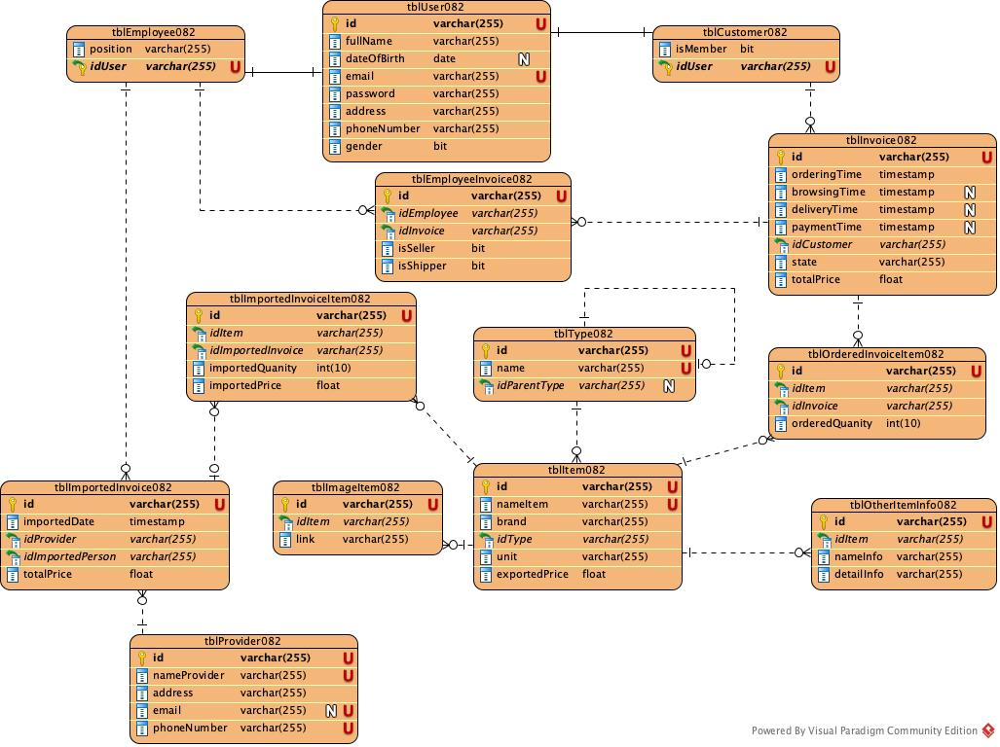
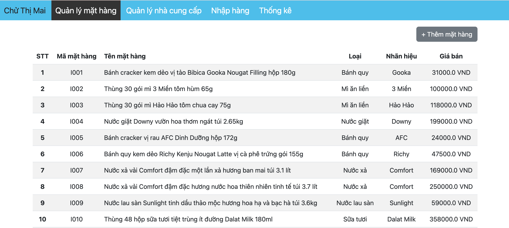
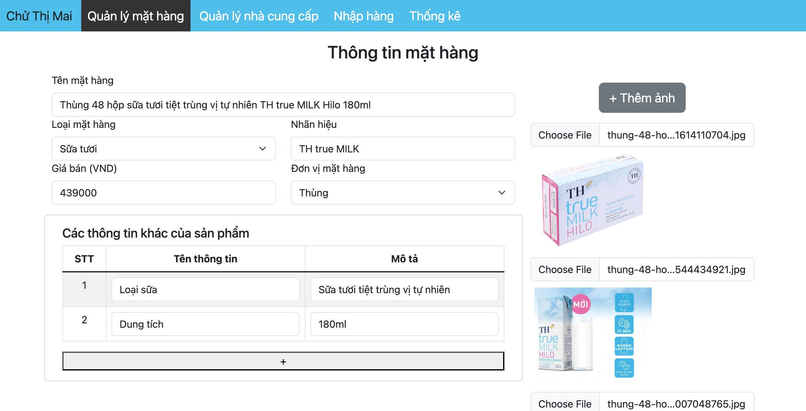
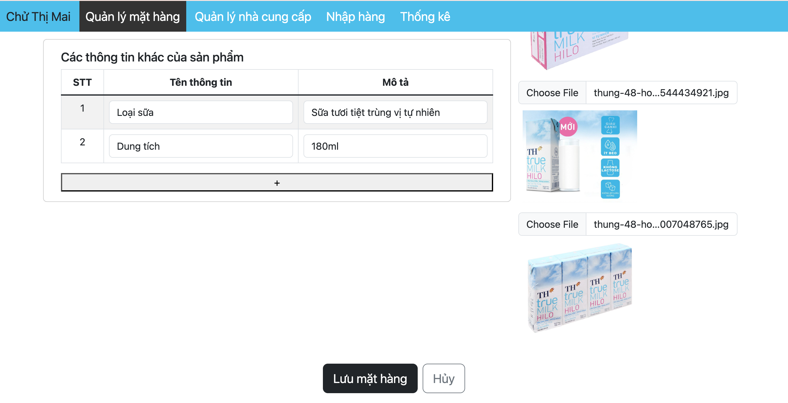
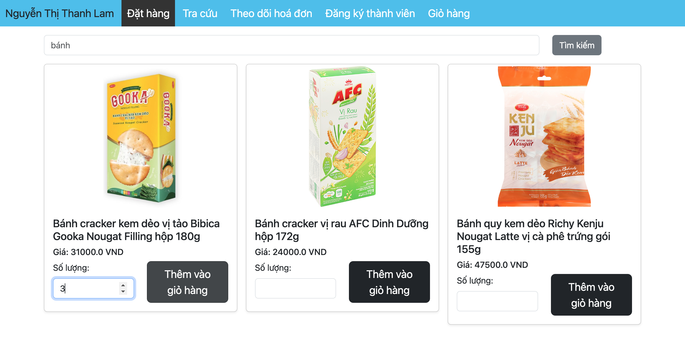
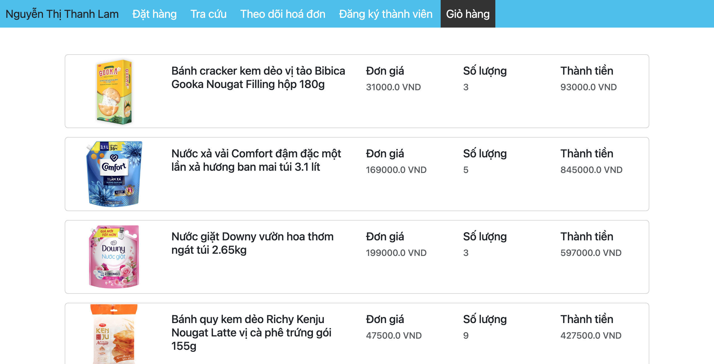
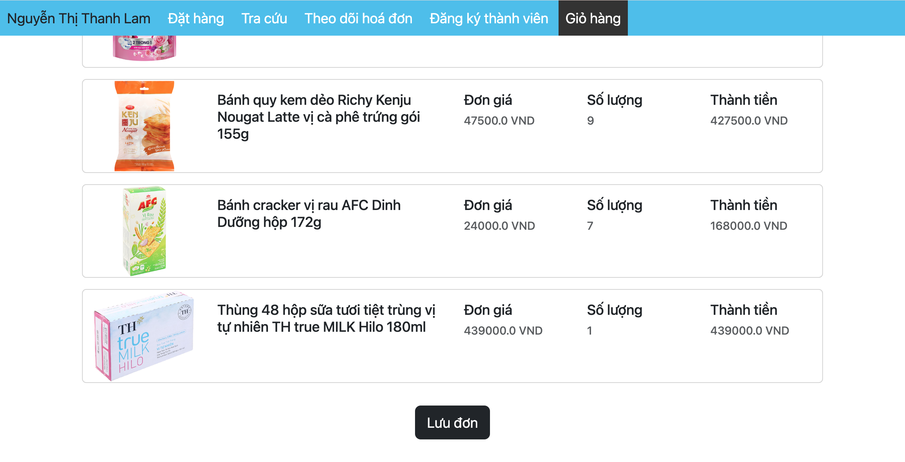
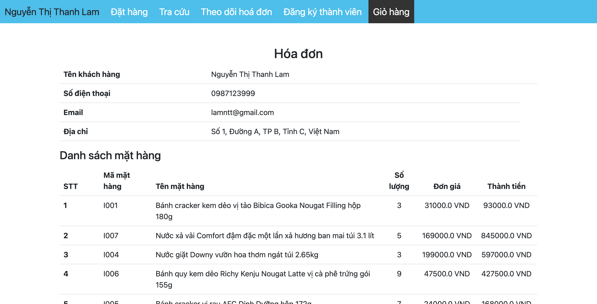
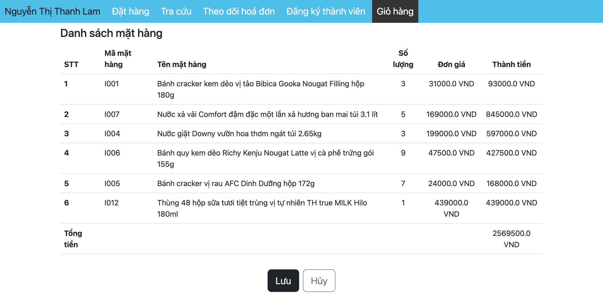

# ShopMan

## Bài tập môn phân tích thiết kế hệ thống thông tin
Làm 2 module là:
- Thêm thông tin mặt hàng
- Đặt mua hàng trực tuyến

### Các công nghệ sử dụng trong bài
- Sử dụng Java Servlet, jsp
- CSDL sử dụng My

### Các thư viện java sử dụng trong bài:
- mysql-connector-j-8.4.0.jar
- servlet-api-2.5.jar
- jstl-1.2.jar

### Cần cài đặt:
- JDK23
- Apache NetBeans IDE 22
- Apache Tomcat or TomEE
- MySQL
- MySQL Workbench

### Cách tổ chức folder và file:
- Các file .jsp:
  - Các file jsp để trong folder web/views/ phân chia thành các trang hiển thị theo vai trò của người dùng trong hệ thống.
  - File index.jsp trong folder web/ để hiển thị trang đăng nhập.
  - File doDangNhap.jsp chứa các lệnh Java để thực hiện đăng nhập.
- Các file .java nằm trong src/java:
  - Các lớp sử dụng để đóng gói nằm trong /model chia thành các lớp liên quan đến user, item và ordering cho vào 3 folder riêng biệt.
  - Các lớp sử dụng để lấy dữ liệu từ trong CSDL ra và đóng gói nằm trong folder /dao
  - Các lớp sử dụng để xử lý các request từ phía client nằm trong folder /controller
### CSDL được thiết kế như sau:


Sử dụng file files/procedure.sql để tạo các thủ tục sau khi dựng xong CSDL.
Chạy lệnh sau trong Terminal (MacOS) để sử dụng được thủ tục:
```bash
 mysql -u root -p shop_man < your_path/procedure.sql
```
Trong đó:
- root là tên localhost của CSDL
- shop_man là tên CSDL

## Kết quả sau khi chạy
### Thêm thông tin mặt hàng
- Giao diện quản lý mặt hàng:
  
- Giao diện thêm thông tin mặt hàng:
  
  
### Đặt mua hàng trực tuyến
- Giao diện đặt hàng sau khi nhập từ khoá và click tìm kiếm:
  
- Giao diện giỏ hàng:


- Giao diện hoá đơn:
  
  


